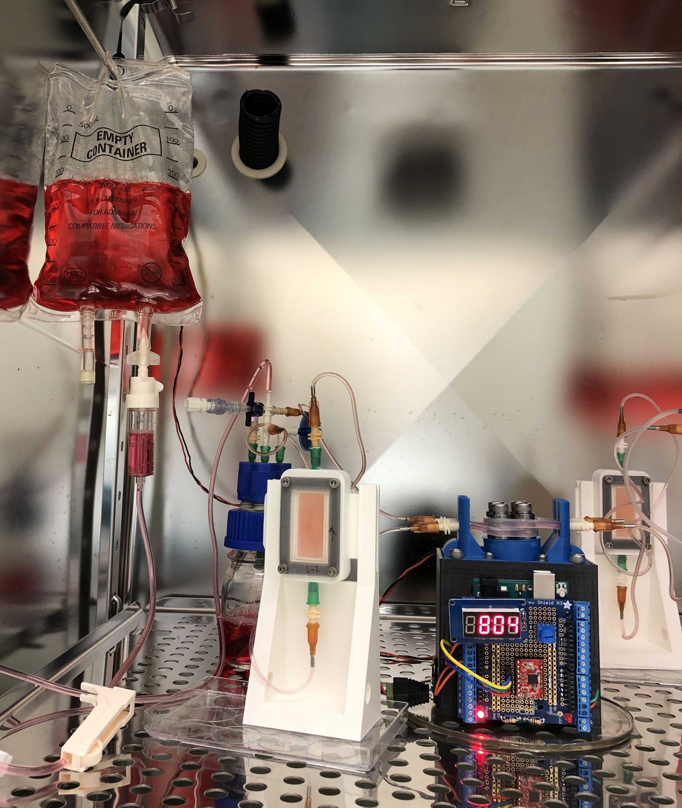

## Some useful 3D printed accessories for perfusion culture
### Ready-to-print STL files and editable design files provided for each item

### - Offset stands for perfusion chambers

This is a simple stand for our perfusion chamber design which positions the inlet of a thin gel high enough above the bench/shelf to connect a sterile filter upstream. The design also makes it easy to handle and transport the chambers, and to rotate them around for endo seeding.

### - Vertical gel stand

Vertical perfusion can give more even fluid transport through gels with highly branched vascular networks. This vertical stand fits our perfusion chamber design if the "fins" option is enabled.

### - Media bag hanging racks

We have built custom media bag racks from aluminum T-slot extrusion (available from Misumi or McMaster-Carr, and others). The design depends on the model of incubator where you need to install it. We have one incubator with solid shelves and perforated walls, where we use rack that mounts to the wall. 

Many incubators have perforated shelves, for which we make a standing rack out of three pieces of extrusion in a U shape (hold together with corner brackets). To mount, we have feet which can be inserted into the shelf perforations. 

The two designs given here may not fit your incubator exactly, but hopefully will give you an idea of what can work.

Parts list for rack:
- 20x20 mm T-slot aluminum extrusions (e.g. McMaster-Carr 5537T514)
- Corner brackets for 20mm T-slot extrusion (e.g. McMaster-Carr 5537T441)
Some brackets come with fasteners. If you need separate fasteners:
- M5 T-slot nuts (e.g. McMaster-Carr 90510A232)
- M5x8 mm bolts (e.g. McMaster-Carr 91292A191)

How the rack's feet can be mounted in an incubator:

Hanging version; feet insert into wall:

### - Media bag hanging hooks

A hanging rack isn't much use without hooks! We have a simple 3D printed hook design which can slide along the tracks of the T-slot extrusion, pictured above.

### - Microscope adapters for imaging perfusion chambers

We include one adapter for a standard multiwell plate format which should fit any standard microscope with a plate imaging stage. We also include a larger adapter for the entire stage footprint of a Nikon Ti-E inverted microscope. With the provided SolidWorks files, this can be modified to fit other brands of microscopes.